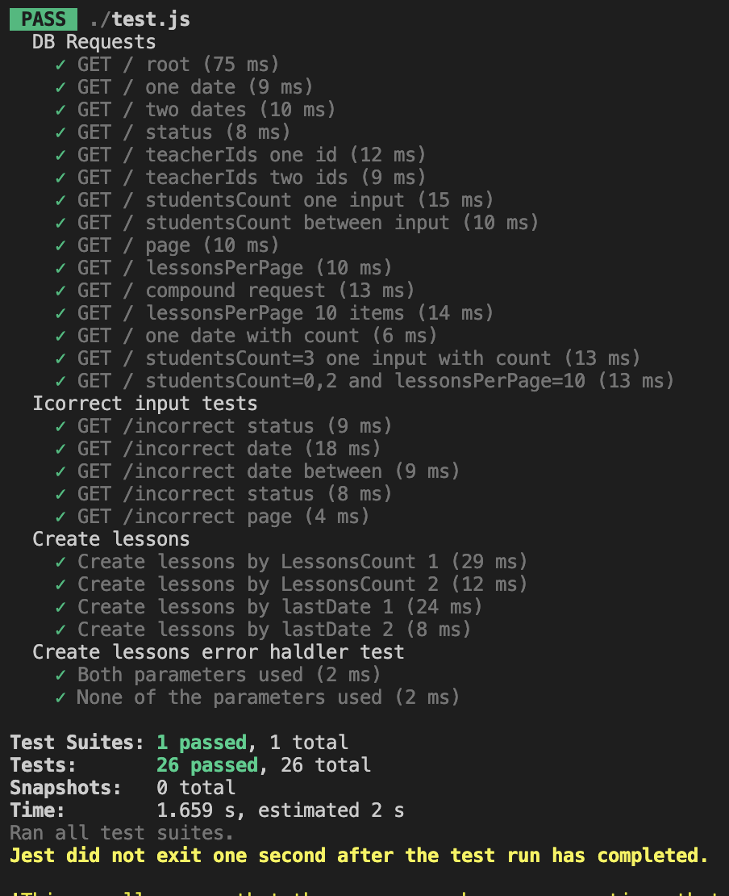

# moyklass_test
test assignment backend js

A node.js application using Expess.js and knex.

1. Search lessons from DB using filters
2. Create lessons by sending json files

`routes/search.js` - search engine for DB.
                    Handles GET / commands with specified filters:

     ?date=YYYY-MM-DD or ?date=YYYY-MM-DD,YYYY-MM-DD
     ?status=0 or ?status=1
     ?teacherIds=N or ?teacherIds=N,M
     ?studentsCount=N or ?studentsCount=N,M
     ?page=N
     ?lessonsPerPage=N

`search/lessons.js` - creates new lessons and writes them to the DB. Please, specify the table name `const tableToPost` at row 3 to make sure you are writing to the correct DB. 

Using super-test and Jest for testing app.
Test response:

October, 2023